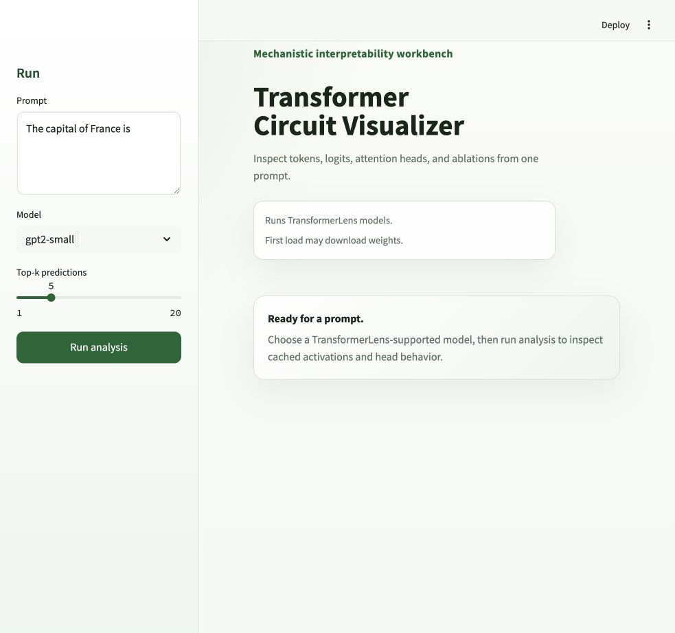

# transformer-circuit-visualizer

An interactive mechanistic interpretability workbench for inspecting transformer tokens, logits, attention heads, and single-head ablations from one prompt.

> Status: initial backend/demo release. The project is useful for local exploration, but it is not yet a polished research platform.

## Screenshot



## Features

- Real TransformerLens model execution with PyTorch.
- Prompt tokenization with token ids and decoded token strings.
- Final-position next-token top-k predictions from raw model logits.
- Layer-by-layer logit lens results at the final sequence position.
- Attention heatmap data for selectable layer/head pairs.
- Per-head summary statistics: entropy, max attention weight, previous-token attention, BOS attention, and output norm when available.
- Single-head ablation comparison with before/after predictions and logit/probability deltas.
- FastAPI backend with typed Pydantic schemas.
- Lightweight Streamlit demo for local exploration.
- Test-only fakes for fast unit tests without model downloads.

## Quickstart

Create a virtual environment:

```bash
python -m venv .venv
source .venv/bin/activate
```

Install the project:

```bash
python -m pip install -e ".[dev,ui,test]"
```

Run a smoke analysis:

```bash
python scripts/smoke_analyze.py --prompt "The capital of France is"
```

The default model is `gpt2-small`. The first run may download weights from Hugging Face. For a smaller local check, use:

```bash
python scripts/smoke_analyze.py --model attn-only-1l --prompt "The capital of France is"
```

If device selection causes problems, force CPU:

```bash
TCV_DEVICE=cpu python scripts/smoke_analyze.py --prompt "The capital of France is"
```

## Streamlit Demo

Run the local UI:

```bash
streamlit run apps/streamlit_app.py
```

Open `http://localhost:8501`. The demo lets you choose a configured TransformerLens model, enter a prompt, set top-k, and inspect tokens, predictions, logit lens tables, attention heatmaps, head summaries, and ablation comparisons.

## API Usage

Start the FastAPI server:

```bash
uvicorn transformer_circuit_visualizer.main:app --reload
```

Health and model list:

```bash
curl http://127.0.0.1:8000/health
curl http://127.0.0.1:8000/models
```

Analyze a prompt:

```bash
curl -X POST http://127.0.0.1:8000/analyze \
  -H "Content-Type: application/json" \
  -d '{"prompt":"The capital of France is","model_name":"gpt2-small","top_k":5}'
```

Fetch one attention pattern:

```bash
curl -X POST http://127.0.0.1:8000/attention \
  -H "Content-Type: application/json" \
  -d '{"prompt":"The capital of France is","model_name":"gpt2-small","layer":0,"head":0}'
```

Summarize heads:

```bash
curl -X POST http://127.0.0.1:8000/heads/summary \
  -H "Content-Type: application/json" \
  -d '{"prompt":"The capital of France is","model_name":"gpt2-small"}'
```

Ablate one head:

```bash
curl -X POST http://127.0.0.1:8000/ablate/head \
  -H "Content-Type: application/json" \
  -d '{"prompt":"The capital of France is","model_name":"gpt2-small","layer":0,"head":0,"top_k":5}'
```

## Development

Run the standard checks:

```bash
python -m pytest
python -m ruff check .
python scripts/smoke_analyze.py --prompt "The capital of France is"
```

Use the raw prediction debugger when next-token output looks surprising:

```bash
python scripts/debug_prediction.py
```

The standard test suite uses deterministic test doubles for most coverage. Use `scripts/debug_prediction.py` when investigating raw model-output surprises.

## Limitations

- No database, auth, background jobs, deployment config, or hosted frontend yet.
- Model loading is local and can be slow or memory-heavy, especially on CPU.
- The Streamlit app is a demo UI, not the planned production frontend.
- Next-token predictions are raw language-model continuations. They are not a factual QA layer.
- Logit lens is implemented as a simple residual-stream unembedding view, not a full interpretability suite.
- Only small TransformerLens-supported models are practical for the initial local workflow.

## Roadmap

- Add a richer frontend once the backend contracts settle.
- Add better model selection, caching, and progress reporting.
- Add circuit comparison views across prompts.
- Add neuron/MLP and residual-stream views.
- Improve ablation controls and diagnostics.
- Add exportable analysis artifacts.

See [docs/roadmap.md](docs/roadmap.md) for more detail.
